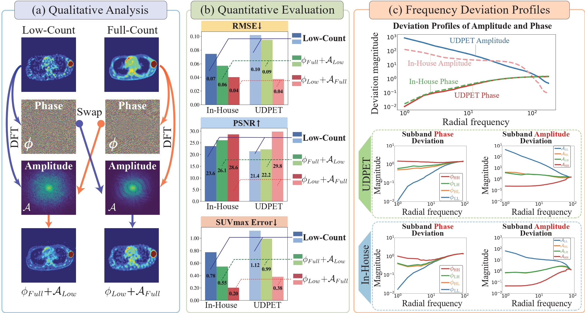
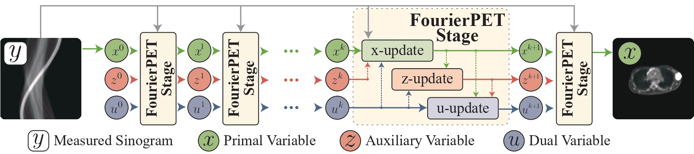

# FourierPET

<p align="center">
  <b>Deep Fourier-based Unrolled Network for Low-count PET Reconstruction</b>
</p>

<p align="center">
  <a href="https://doi.org/10.1609/aaai.v40i15.38299"></a>
  <a href="https://arxiv.org/abs/2601.11680"></a>
  <a href="LICENSE"></a>
</p>

<p align="center">
  <a href="#overview">Overview</a> •
  <a href="#installation">Installation</a> •
  <a href="#data-preparation">Data</a> •
  <a href="#training">Training</a> •
  <a href="#evaluation">Evaluation</a> •
  <a href="#citation">Citation</a>
</p>

This is the official PyTorch implementation of **"FourierPET: Deep Fourier-based Unrolled Network for Low-count PET Reconstruction"**, accepted at **AAAI 2026 (Oral)**.

> **TL;DR** — We reveal that low-count PET degradations are spectrally separable (high-freq phase drift vs. low-freq amplitude suppression) and propose an ADMM-unrolled framework with frequency-aware correction modules.

## Overview

Low-count PET images suffer from three intertwined degradations: Poisson noise, photon scarcity, and attenuation correction (AC) errors. Through Fourier-domain analysis, we show that these degradations exhibit *separable spectral signatures* — Poisson noise and photon scarcity mainly perturb high-frequency phase, while AC errors suppress low-frequency amplitude.
<p align="center">
  
</p>
Based on this insight, we propose **FourierPET**, an ADMM-unrolled reconstruction framework with three tailored modules:

- **Spectral Consistency Module (SCM)** — enforces data fidelity and global frequency alignment via state-space Fourier neural operators.
- **Amplitude–Phase Correction Module (APCM)** — decouples and corrects low-frequency amplitude suppression and high-frequency phase distortions.
- **Dual Adjustment Module (DAM)** — learns an adaptive dual update step to accelerate and stabilize convergence.

<p align="center">
  
</p>


## Installation

```bash
git clone https://github.com/xiaochaorouz/FourierPET.git
cd FourierPET
pip install -r requirements.txt
```

### Dependencies

- Python ≥ 3.10
- PyTorch ≥ 2.1.1
- [torch-radon](https://github.com/matteo-ronchetti/torch-radon)
- [pytorch_wavelets](https://github.com/fbcotter/pytorch_wavelets)
- See `requirements.txt` for the full list.

## Data Preparation

This project uses LMDB-format datasets. Configure dataset paths in the YAML config file:

```yaml
# Example: BrainWeb simulated data
train_db_name: Simulated_data
val_db_name:   Simulated_data
pet_path:      /path/to/brainweb_pet.lmdb
prior_path:    /path/to/brainweb_mr.lmdb
```

## Training

```bash
python train.py --config_exp configs/FourierPET_3_2.yml
```

Checkpoints, logs, and figures are saved to `outputs/FourierPET_3_2/`.

## Evaluation

```bash
# Single checkpoint
python test.py --config_exp configs/FourierPET_3_2.yml \
               --checkpoint outputs/FourierPET_3_2/checkpoint.pth.tar

# LOOCV — evaluate all folds
python test.py --config_exp configs/FourierPET_3_2.yml --loocv

# Evaluate a specific fold
python test.py --config_exp configs/FourierPET_3_2.yml --loocv_fold 3

# Save reconstructed images
python test.py --config_exp configs/FourierPET_3_2.yml \
               --checkpoint outputs/.../checkpoint.pth.tar --save_images
```

Results (JSON metrics and optional image grids) are saved to `outputs/<exp_name>/test_results/`.

## Citation

If you find this work useful, please cite:

```bibtex
@article{Zhang_Tang_Hu_Hu_Qin_2026,
  title   = {FourierPET: Deep Fourier-based Unrolled Network for Low-count PET Reconstruction},
  author  = {Zhang, Zheng and Tang, Hao and Hu, Yingying and Hu, Zhanli and Qin, Jing},
  journal = {Proceedings of the AAAI Conference on Artificial Intelligence},
  volume  = {40},
  number  = {15},
  pages   = {12997--13005},
  year    = {2026},
  month   = {Mar.},
  doi     = {10.1609/aaai.v40i15.38299},
}
```

## Acknowledgements

Thanks to the [EfficientViM](https://github.com/mlvlab/EfficientViM) authors for their code (CVPR 2025).

## License

This project is licensed under the MIT License. See [LICENSE](LICENSE) for details.
